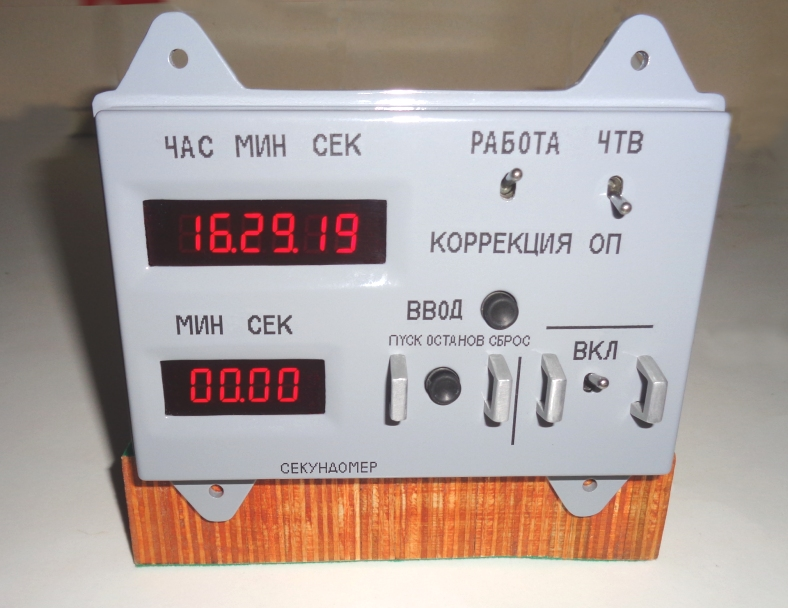
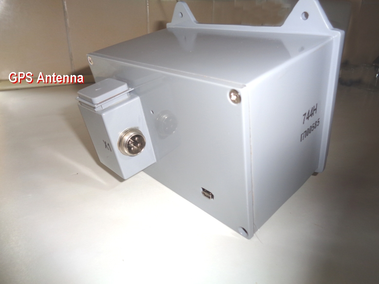
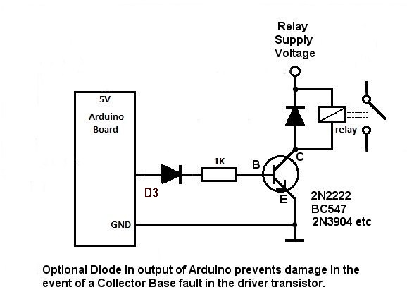
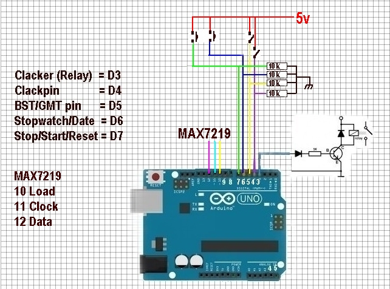
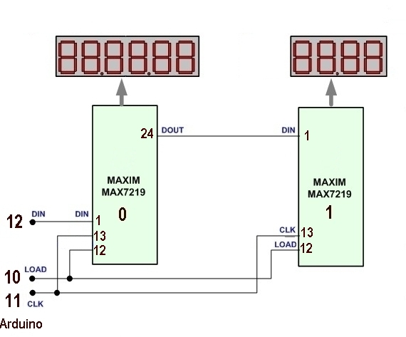
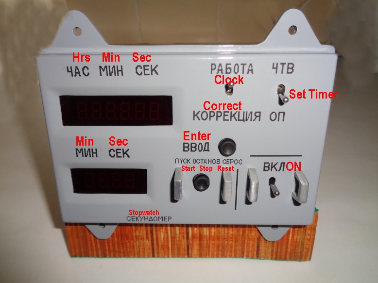
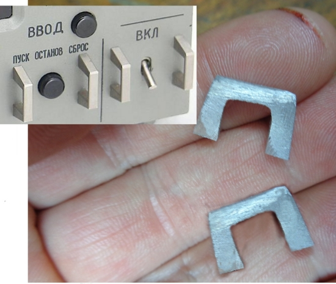
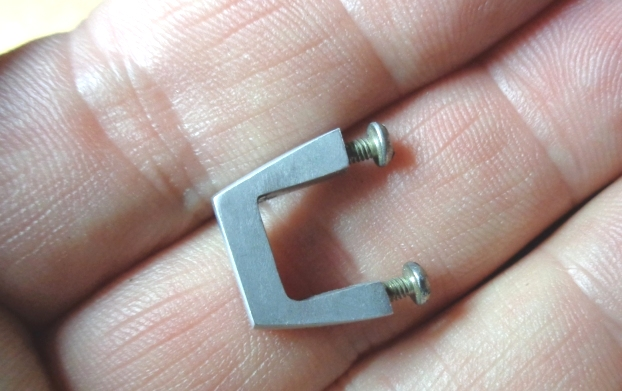
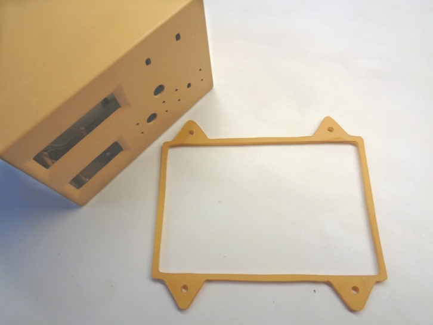
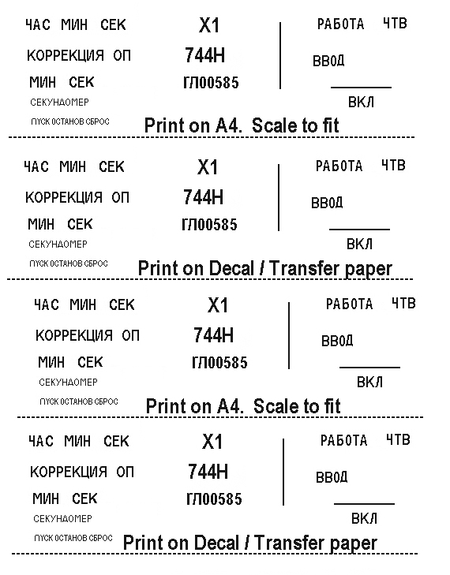

<meta name='keywords' content='G4FEV, SDRUno, SDRplay'>

# SOYUZ CAPSULE DIGITAL CLOCK

## David Whitty G4FEV

<i>Last edit 18th Jan 2021.</i>

This software is given freely for non-commercial use with no guarantee given or implied.

<a href="https://github.com/G4FEV/Soyuz-Capsule-Digital-Clock/archive/master.zip"> DOWNLOAD SOYUZ CLOCK PROJECT as zip</a>

## What is this?

An Arduino is used to decode NMEA data from a GPS Module and display the time and date.
The display uses a 6 digit 7 segment display forTtime and a 4 digit display for Date and Stopwatch.
The clock is in the form of a Soyuz 744H digital clock installed in the Soyuz capsule.
An internet search for "Soyuz 744H digital clock" will produce a host of interesting information
and videos on these rare and interesting icons from the early days of Space exploration.

 
 
 ## Hardware Requirements.
Arduino nano or Arduino of your choice. A suitable GPS module and GPS antenna.
Two MAX7219 Display Drivers (MAX 7219 can only drive 8 displays, we require 10 for this project).
Ten 0.36" Red 7 Segment Displays. Various things from the junk box. i.e 7805 DC regulator, Vero/Matrix board, 3 Toggle Switches, 2 Push-Botton Switches.

For the case I used two Eddystone (Hammond) Die cast Boxs type 396 (145x95x49) which are fairly close but not exactly 1:1 scale with the original.
The boxs are bolted back-to-back to achieve the correct depth and the join filled with car body filler (Bondo).

An optional 52x38x31mm box fixed to the rear cover to replicate the "X1" connector housing. (Which also provides an ideal location for a GPS flat ceramic antenna)

An optional relay may be added on pin D3 which is used to simply add a ticking sound when D3 is pulsed (The clacker)
The maximum current an Arduino pin can switch is 40mA so we use a transistor to switch the relay.
  

 

  

## SOFTWARE

You will require SoftWare SerialLibrary (normally provided within the Arduino IDE.
TinyGPS Library

## Does it compile?

Beware! There are several versions of  SoftwareSerial andTinyGPS libraries which may not be compatible without minor changes to the declarations.

Built & tested using Arduino IDE Version 1.8.13

SoftwareSerial from Arduino IDE Version 1.8.13

We use the SoftwareSerial library for the coms from the GPS. 
Pin 8 is Rxd and 9 Txd which leaves the normal Arduino coms port for debugging information via the IDE Serial Monitor.
As we don't send anything to the GPS pin 9 is left unconnected.

Circuit diagram arduino
Circuit of clacker
list of interfacees/switches and clacker.
add transfer sheet
Transfer sheet
edit gmt bst time

If you choose to use the Ready mounted Arduino relay available on auction sites <B>"CAUTION"</B> as many of these are Active LOW. 
The code is designed for ACTIVE HIGH.
If you decide to use these Ready-Made Relay Boards look for the type with a jumper that can be set ACTIVE HI.

 
 

Default baud rate for GPS is set at 9600
Brightness on display is set by.
Clack routine (See the clack void at the end of the sketch) set delay to suit your chosen relay
Get the MAX7219 and its display woring first using the Hello Worls example sketch.

     

## Notes.

* <b>Multi VRX setups.</b> 
You can use as many Smart-Switches as you like and allocate a Smart-Switch to each VRX. Just set the com port for each individual Smart-Switch to the VRX as above.

* <b> Scanning.</b> It may be unwise to switch antennas while scanning. Ensure your scanning frequencies are all on one band for optimum performance. It will work however the switching time may cause signals to be lost during the changeover period.

* <b>Error message on starting SDRUno.</b> If you start SDRUno before connecting the FTDI USB converter it will throw up this error. It's no big deal, just go into the VRX <b>SETT</b> and toggle the <b>CAT</b> setting <b>ENABLE & CONNECT</b>

 

* <b>LCD Blank Screen.</b>
Have you set the correct I2c address for your LCD. These are normally  0x3F or 0xFF or even 0x27 if you have an older display.
Use the Arduino I2c scanner sketch to confirm your address and the Hello World example to check it works

* <b>Serial.print messages.</b>
If you uncomment ALL the Serial.print messages the code will run slower and a warning will appear when compiling;-      

<B><i>Low dynamic memory warning 78% may cause instability</B></i>

Remember to re-comment these before final use for optimum performance.

## Practical Application

That's all folks. 73 de Dave G4FEV.

<a href="https://github.com/G4FEV/Soyuz-Capsule-Digital-Clock/archive/master.zip"> DOWNLOAD SOYUZ CLOCK PROJECT as zip</a>
