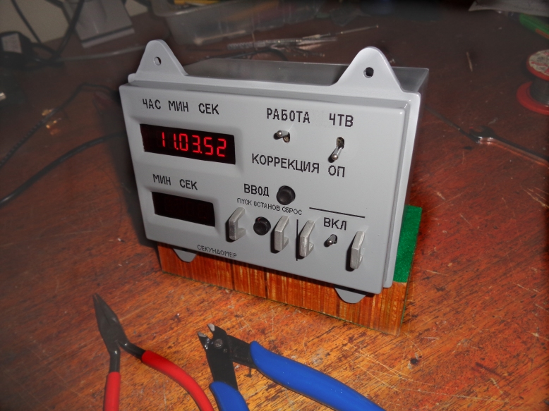
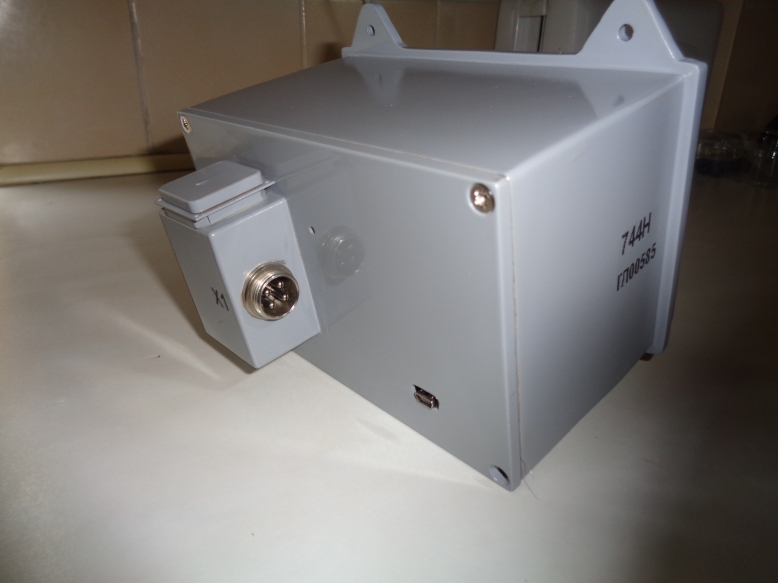

<meta name='keywords' content='G4FEV, SDRUno, SDRplay'>

# SOYUZ CAPSULE DIGITAL CLOCK

## David Whitty G4FEV

<i>Last edit 18th Jan 2021.</i>

This software is given freely for non-commercial use with no guarantee given or implied.

<a href="https://github.com/G4FEV/Soyuz-Capsule-Digital-Clock/archive/master.zip"> DOWNLOAD SOYUZ CLOCK PROJECT as zip</a>

## What is this?

An Arduino is used to decode NMEA data from a GPS Module and display the time and date.
The display uses a 6 digit 7 segment display for time and a 4 digit display for date and stopwatch.

You will require SoftWare SerialLibrary (normally provided within the Arduino IDE.
TinyGPS Library

## Does it compile?

Beware! There are several versions of  SoftwareSerial andTinyGPS libraries which may not be compatible without minor changes to the declarations.

Built & tested using Arduino IDE Version 1.8.13

SoftwareSerial from Arduino IDE Version 1.8.13

We use the SoftwareSerial library for the coms from the GPS. 
Pin 8 is Rxd and 9 Txd which leaves the normal Arduino coms port for debugging information via the IDE Serial Monitor.
As we don't send anything to the GPS pin 9 is left unconnected.

## Hardware Requirements.
Arduino nano or Arduino of your choosing
A suitable GPS module and GPS antenna.

<B> RELAYS </B>

The maximum current an Arduino pin can switch is 40mA so we use a transistor to switch coax relays or slave relays.

If you choose to use the Ready mounted Arduino relays available on auction sites "CAUTION". Many of these are Active LOW. 
The code is designed for ACTIVE HIGH.
You could swap all the Hi and lows but it would mean most of your relays would be operated all the time.
If you decide to use these Ready-Made Relay Boards look for the type with a jumper that can be set ACTIVE HI.

   
 

## SOFTWARE

Set the correct I2c address for your LCD I2c or you will just see a blank screen. (0x27) for older displays (0x3F) for newer displays or use the Arduino I2c scanner to discover the address.

<B>Setting the Band Limits</B>

Modify this part of the code to suit your application, located near the top of the sketch.
You may edit the frequencies and the Antenna / Filter name.
Shown below are the first three, of 14, Bands

     
Notice how the next band up starts one Hertz above the last band.
The bands don’t have to run contiguously. This is just an example.

<B>SUGGESTION.</B>

* Run the code unmodified using LEDs on the Band Outputs and see how they react to frequency changes before you modify for your own requirements. 

* You don’t have to use all the outputs just park them out of the way near the 2GHz (or 1KHz) end of the spectrum so they never operate or comment them out.

* Take care as you move higher up in the spectrum. There are lots of zeroooos to trip over. It’s easy to get in a right old mess. (I speak from experience!)

Serial.print debug messages have been commented-out, apart from the current Frequency.

Uncommenting the remaining Serial.print messages will allow the user to monitor the decoding process the results of which may be viewed on the serial monitor as the program runs. Remember to Re-comment Serial.print messages when you are finished and the code will run slightly faster.

## SETTING UP SDRUno

Plug in your USB to FTDI-TTL converter and note its Com port. On Windows find this in <i><b> Devices and Printers.</i></b>

Top Left corner of theSDRUno <b> RX Control window </b> click the<b> SETT</b> button. Navigate along to the <b>CAT</b> option.

Select the com port and set the Baud Rate to 9600. Select <B> Enable & Connect.</B>

That’s it. 

If all is well the Smart-Switch LCD display should change from <B>“Waiting for data”</B>

## Notes.

* <b>Multi VRX setups.</b> 
You can use as many Smart-Switches as you like and allocate a Smart-Switch to each VRX. Just set the com port for each individual Smart-Switch to the VRX as above.

* <b> Scanning.</b> It may be unwise to switch antennas while scanning. Ensure your scanning frequencies are all on one band for optimum performance. It will work however the switching time may cause signals to be lost during the changeover period.

* <b>Error message on starting SDRUno.</b> If you start SDRUno before connecting the FTDI USB converter it will throw up this error. It's no big deal, just go into the VRX <b>SETT</b> and toggle the <b>CAT</b> setting <b>ENABLE & CONNECT</b>

* <b>LCD Blank Screen.</b>
Have you set the correct I2c address for your LCD. These are normally  0x3F or 0xFF or even 0x27 if you have an older display.
Use the Arduino I2c scanner sketch to confirm your address and the Hello World example to check it works

* <b>Serial.print messages.</b>
If you uncomment ALL the Serial.print messages the code will run slower and a warning will appear when compiling;-      

<B><i>Low dynamic memory warning 78% may cause instability</B></i>

Remember to re-comment these before final use for optimum performance.

## Practical Application

For antenna switching I use a 6 Way SMA relay configured for Bands A to F. The display unit is connected to the relay box located under the bench. 

    

That's all folks. 73 de Dave G4FEV.
