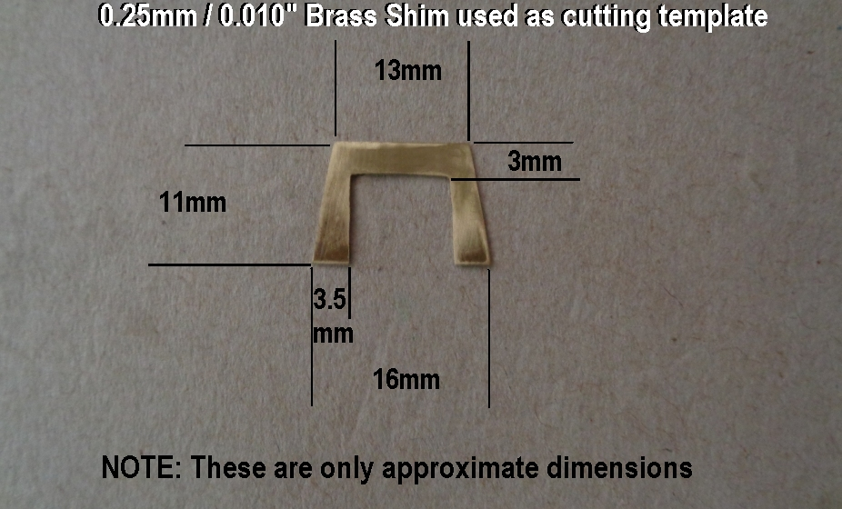

<meta name='keywords' content='G4FEV, SDRUno, SDRplay'>

# SOYUZ CAPSULE DIGITAL CLOCK

## David Whitty G4FEV

<i>Last edit 18th Jan 2021.</i>

This software is given freely for non-commercial use with no guarantee given or implied.

<a href="https://github.com/G4FEV/Soyuz-Capsule-Digital-Clock/archive/master.zip"> DOWNLOAD SOYUZ CLOCK PROJECT as zip</a>

## What is this?

An Arduino is used to decode NMEA data from a GPS Module and display the time and date.
The display uses a 6 digit 7 segment display forTtime and a 4 digit display for Date and Stopwatch.
The clock is in the form of a Soyuz 744H digital clock installed in the Soyuz capsule.
An internet search for "Soyuz 744H digital clock" will produce a host of interesting information
and videos on these rare and interesting icons from the early days of Space exploration.

 
 
 ## Hardware Requirements.
Arduino nano or Arduino of your choice. A suitable GPS module and GPS antenna.
Two MAX7219 Display Drivers (MAX 7219 can only drive 8 displays, we require 10 for this project).
Ten 0.36" Red 7 Segment Displays. Various things from the junk box. i.e 7805 DC regulator, Vero/Matrix board, 3 Toggle Switches, 2 Push-Botton Switches.

For the case I used two Eddystone (Hammond) Die cast Boxs type 396 (145x95x49) which are fairly close but not exactly 1:1 scale with the original.
The boxs are bolted back-to-back to achieve the correct depth and the join filled with car body filler (Bondo).

An optional 52x38x31mm box fixed to the rear cover to replicate the "X1" connector housing. (Which also provides an ideal location for a GPS flat ceramic antenna)

An optional relay may be added on pin D3 which is used to simply add a ticking sound when D3 is pulsed (The clacker)
The maximum current an Arduino pin can switch is 40mA so we use a transistor to switch the relay. Alternativly a small Piezo sounder may provide a similar "ticking" effect.
  
 

 

 * Get the MAX7219 and its display working first using the Hello World example sketch included with the IDE.
  

## SOFTWARE.
<U><B>Does it compile?</B></U>

You will require SoftwareSerial.h Library (normally provided within the Arduino IDE).
<i>We use the SoftwareSerial library for the coms from the GPS. 
Pin 8 is Rxd and 9 Txd which leaves the normal Arduino coms port for debugging information via the IDE Serial Monitor.
As we don't send anything to the GPS pin 9 is left unconnected.</i>

TinyGPS++.h Library

LedControl.h Library Normally provided with Arduino IDE.

Built & tested using Arduino IDE Version 1.8.13

<B>Beware!</B> There are several versions of  SoftwareSerial andTinyGPS libraries which may not be compatible without minor changes to the declarations.

<U><B>Software Settings.</B></U>
Various settings may require editing to suit your requirements;-

GPS Baud Rate. Default baud rate for GPS is set at 9600.

GMT/UTC offset for daylight saving time is set by the variable GMTOffest = . can be a positive or negative number.

7 Segment Display Brightness.  Set by the following lines in Setup Void. (Default is 5)

       lc.setIntensity(0,5);// 0=Top display. Second digit=brightnes 0 to 15
       
       lc.setIntensity(1,5);// 1=Lower display. Second digit=brightnes 0 to 15

Clack Void (See the clack void at the end of the sketch) set delay to suit your chosen relay.

 
 ## Notes.

translation of the front panel markings.

 

 
 The switch guards are fabricated using 4mm Alluminium using a jewelers saw and files from a brass template. (Took me about week with very sore fingers so persevere as these are a distinctive feature and worth having.
.

 
 The mounting flange was cut from Paxolin board or a similar plastic and bonded to the case with 2 pack epoxy glue.
 
 

* <b>Multi VRX setups.</b> 

That's all folks. 73 de Dave G4FEV.

<a href="https://github.com/G4FEV/Soyuz-Capsule-Digital-Clock/archive/master.zip"> DOWNLOAD SOYUZ CLOCK PROJECT as zip</a>
